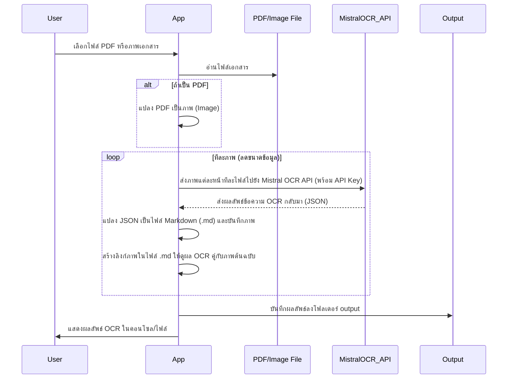

# OCR คืออะไร? ประโยชน์และสายงานที่เหมาะสม

OCR (Optical Character Recognition) คือเทคโนโลยีที่ช่วยแปลงข้อความจากภาพหรือเอกสารสแกนให้กลายเป็นข้อความที่สามารถแก้ไขและค้นหาได้

**หลักการทำงานของ OCR**
- ระบบจะรับข้อมูลเป็นไฟล์ภาพ เช่น JPG, PNG หรือ PDF ที่มีข้อความอยู่ในภาพ
- ใช้เทคนิคการประมวลผลภาพ (Image Processing) เพื่อแยกแยะส่วนที่เป็นตัวอักษรออกจากพื้นหลัง
- นำตัวอักษรที่แยกได้ไปเปรียบเทียบกับฐานข้อมูลรูปแบบตัวอักษร (Font/Character Database) หรือใช้ AI/Deep Learning เพื่อทำนายว่าคือตัวอักษรอะไร
- ผลลัพธ์ที่ได้จะเป็นข้อความดิจิทัลที่สามารถนำไปใช้งานต่อได้

**ตัวอย่างการใช้งาน OCR ในชีวิตจริง**
- แปลงเอกสารราชการหรือใบเสร็จให้เป็นไฟล์ Word/Excel
- อ่านข้อมูลจากบัตรประชาชน ใบขับขี่ หรือพาสปอร์ต
- ดึงข้อมูลจากใบแจ้งหนี้ ใบกำกับภาษี หรือเอกสารทางบัญชี
- ค้นหาข้อความในเอกสารสแกนจำนวนมากอย่างรวดเร็ว

**ข้อดีของ OCR**
- ลดเวลาการพิมพ์ข้อมูลซ้ำ
- ลดข้อผิดพลาดจากการกรอกข้อมูลด้วยมือ
- ค้นหาและจัดการเอกสารได้ง่ายขึ้น
- รองรับการทำ Digital Transformation ในองค์กร

**ข้อจำกัดของ OCR**
- ความแม่นยำขึ้นกับคุณภาพของภาพและรูปแบบตัวอักษร
- อาจมีปัญหากับเอกสารที่มีรอยเปื้อน ตัวอักษรซ้อน หรือฟอนต์แปลก
- ภาษาและรูปแบบเอกสารบางประเภทอาจต้องใช้โมเดลเฉพาะทาง

OCR จึงเหมาะกับงานที่ต้องการแปลงเอกสารกระดาษเป็นดิจิทัล เช่น งานบัญชี กฎหมาย การศึกษา โลจิสติกส์ หรือธุรกิจที่ต้องจัดการเอกสารจำนวนมาก

## Mistral AI คืออะไร?

Mistral AI คือบริษัทเทคโนโลยีด้านปัญญาประดิษฐ์ (AI) จากยุโรปที่มุ่งเน้นการพัฒนาโมเดลภาษาและโซลูชัน AI สำหรับงานเอกสารและข้อมูลขนาดใหญ่ จุดเด่นของ Mistral AI คือการสร้างโมเดลที่มีประสิทธิภาพสูง รองรับหลายภาษา และสามารถนำไปประยุกต์ใช้กับงานจริงได้หลากหลาย เช่น การสรุปเนื้อหา การแปลภาษา การวิเคราะห์ข้อความ และ OCR โดยเน้นความปลอดภัย ความเป็นส่วนตัว และความโปร่งใสในการใช้งาน AI

### บริการหลักของ Mistral AI

- **Mistral Large Language Model (LLM):** โมเดลภาษา AI ขนาดใหญ่สำหรับงานสรุปเนื้อหา ตอบคำถาม วิเคราะห์ข้อความ และสร้างเนื้อหาอัตโนมัติ
- **Mistral OCR:** บริการแปลงข้อความจากภาพหรือ PDF เป็นข้อความดิจิทัล รองรับหลายภาษาและรูปแบบเอกสาร
- **Translation:** บริการแปลภาษาด้วย AI ที่แม่นยำและรวดเร็ว
- **Document Summarization:** สรุปเนื้อหาจากเอกสารยาว ๆ ให้สั้น กระชับ เข้าใจง่าย
- **Data Extraction:** ดึงข้อมูลสำคัญจากเอกสาร เช่น ตาราง ตัวเลข หรือข้อมูลเฉพาะทาง
- **Custom AI Solutions:** ให้บริการปรับแต่งโมเดล AI ตามความต้องการของลูกค้าองค์กร

ดูรายละเอียดเพิ่มเติมได้ที่ [https://mistral.ai](https://mistral.ai)

# Mistral OCR คืออะไร? จุดเด่นและความแตกต่าง

Mistral OCR คือบริการ OCR ที่พัฒนาโดย Mistral AI โดดเด่นด้วยความแม่นยำสูง รองรับหลายภาษา และใช้งานผ่าน API ได้ง่าย ต่างจาก OCR ทั่วไปตรงที่มี AI Model ที่ทันสมัยและปรับแต่งได้ตามงานเฉพาะทาง

# วิธีสมัครและขอ Mistral OCR API Key

1. สมัครสมาชิกที่ [Mistral AI](https://mistral.ai)
2. เข้าสู่ระบบและไปที่หน้า API Management
3. สร้าง API Key ใหม่และคัดลอกเก็บไว้

# Workflow ของโปรเจกต์นี้



# อธิบายผลลัพธ์ OCR ที่ได้

- ผลลัพธ์ข้อความที่ได้จาก Mistral OCR จะถูกส่งกลับมาในรูปแบบ JSON ซึ่งประกอบด้วยข้อมูลข้อความที่ตรวจจับได้ ตำแหน่งของข้อความ และข้อมูลเกี่ยวกับภาพแต่ละหน้า
- ระบบจะนำข้อมูล JSON นี้มาแปลงเป็นไฟล์ Markdown (`.md`) โดยแต่ละหน้าของเอกสารจะมีไฟล์ `.md` แยกต่างหาก และในแต่ละไฟล์จะมีการลิงก์ (link) ไปยังภาพต้นฉบับของแต่ละหน้า
- ภาพแต่ละหน้าที่แยกออกมาจาก PDF จะถูกบันทึกไว้ในโฟลเดอร์ `0.SplitPdfToImages/` ภายใต้เอกสารแต่ละประเภท
- ในไฟล์ Markdown ที่ได้ จะมีการฝังลิงก์หรือแสดงภาพ (``) เพื่อให้สามารถดูภาพต้นฉบับและผลลัพธ์ OCR ได้ในเอกสารเดียวกัน
- ตัวอย่างโครงสร้างไฟล์:

```text
docs/output/1.Scanned/
  0.SplitPdfToImages/
    page1.png
    page2.png
  1.MistralOCR/
    page-1/
      page-1.md   <-- มีลิงก์ไปยัง ../0.SplitPdfToImages/page1.png
      page-1.png
    page-2/
      page-2.md
      page-2.png
```

- ตัวอย่างเนื้อหาในไฟล์ `page-1.md`:

```markdown
# ผลลัพธ์ OCR หน้า 1


ข้อความที่ตรวจจับได้:
- ...ข้อความจาก OCR...
```

- ผู้ใช้สามารถเปิดไฟล์ `.md` เพื่อดูผลลัพธ์ข้อความและคลิกดูภาพต้นฉบับแต่ละหน้าได้ทันที

# วิธีติดตั้ง .NET 8

1. ดาวน์โหลด .NET 8 SDK จาก [Microsoft .NET Download](https://dotnet.microsoft.com/en-us/download/dotnet/8.0)
2. ติดตั้งตามขั้นตอนที่ระบบปฏิบัติการของคุณแนะนำ
3. ตรวจสอบด้วยคำสั่ง `dotnet --version`

## จักรวาลของ Mistral AI

Mistral AI มีบริการหลากหลาย เช่น OCR, Translation, Summarization, และ AI Model อื่น ๆ ที่เน้นงานเอกสารและภาษา

# การใช้งาน Mistral OCR และการใส่ API Key ในโปรเจกต์

- นำ API Key ที่ได้มาใส่ในไฟล์ `appsettings.json` หรือกำหนดเป็น Environment Variable
- ตัวอย่างในโปรเจกต์นี้จะอ่าน API Key จากไฟล์คอนฟิก

## ค่าใช้จ่ายของ Mistral OCR

- Mistral OCR คิดค่าบริการตามจำนวนหน้าหรือจำนวนคำที่ประมวลผล
- มีแพ็กเกจฟรีและแบบชำระเงิน ขึ้นกับปริมาณการใช้งาน

# ตัวอย่างเอกสาร 4 ประเภทและจุดประสงค์

1. Scanned Document: เอกสารที่สแกนจากกระดาษ
2. Table Pure: เอกสารที่มีตารางเป็นหลัก
3. Image: เอกสารที่เป็นภาพล้วน
4. Text With Table With Image: เอกสารที่มีทั้งข้อความ ตาราง และภาพ

# ทดลองรันโค้ด

1. สั่ง build ด้วย `dotnet build POCMistralOCR/POCMistralOCR.csproj`
2. สั่ง run ด้วย `dotnet run --project POCMistralOCR/POCMistralOCR.csproj`

# อธิบายการทำงานของโค้ดทีละจุด

1. อ่านไฟล์ PDF/ภาพจากโฟลเดอร์ input
2. แปลง PDF เป็นภาพ (ถ้ามี)
3. ส่งภาพไปยัง Mistral OCR API
4. รับข้อความและบันทึกผลลัพธ์
5. แสดงผลลัพธ์ในคอนโซล

# สรุป Recap และแนวทางต่อยอด

- OCR ช่วยลดเวลาการจัดการเอกสาร
- Mistral OCR ใช้งานง่ายและแม่นยำ
- สามารถนำไปต่อยอดกับงาน Automation, Data Extraction, หรือเชื่อมต่อกับระบบอื่น ๆ ได้

หวังว่าบทความนี้จะช่วยให้คุณเข้าใจและเริ่มต้นใช้งาน OCR ด้วย Mistral AI ได้อย่างมั่นใจ!